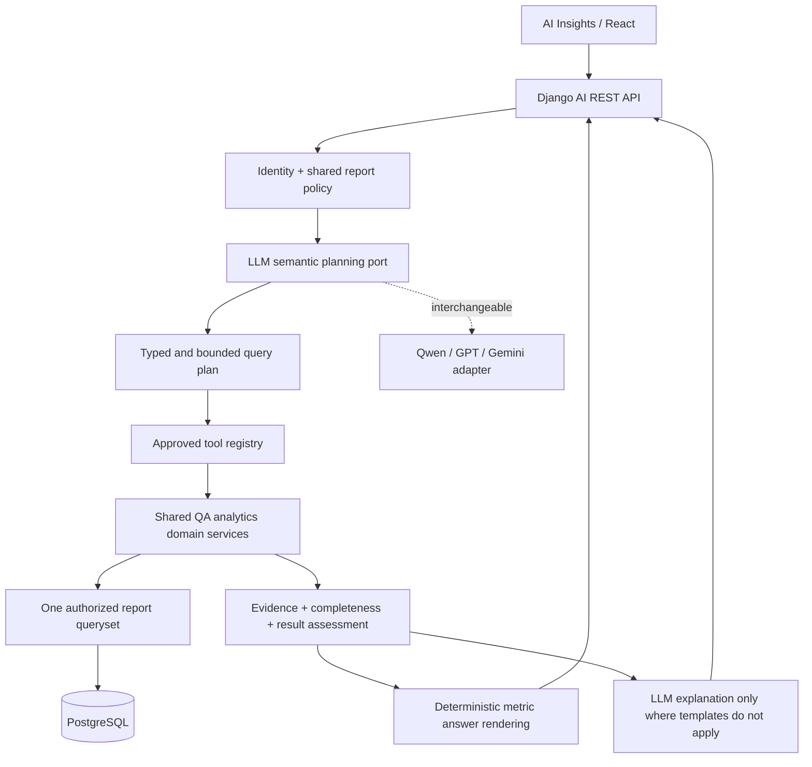

# CallLens AI Insights — Semantic Analytics Architecture V2

**Status:** implementation candidate; requires Django tests, browser build, role-isolation tests, and a GPU end-to-end evaluation **on staging** before production use.

This branch refactors the **existing** AI-enabled QA Portal repository. It **does not** change the GPU FastAPI gateway or llama.cpp configuration. The admin email/routines subsystem is not part of this change and is not implicitly enabled.

## Architecture and ownership



**Django owns facts and permissions.** The model proposes semantic intent, never SQL, a user role, a filter that expands report access, arbitrary HTTP requests or side-effecting actions.

### Modules

| Location | Responsibility |
|---|---|
| `backend/apps/access/report_scope.py` | Authoritative existing `scoped_reports` and `_report_base_queryset`, now shared by calls, dashboard and AI. |
| `backend/apps/access/policy.py` | Management access eligibility and permitted report scope. |
| `backend/apps/analytics/services/core.py` | Reusable scoped-query, date, score and evidence helpers. |
| `backend/apps/analytics/services/{discovery,performance,reviews,recurrence}.py` | Existing 24 business calculations extracted from the former monolithic AI tool module. No provider dependencies. |
| `backend/apps/ai_assistant/tools.py` | Only typed tool declarations bound to analytics services. |
| `backend/apps/ai_assistant/planning.py` | Explicit schema for a single validated semantic intent and timeframe. Supports company/branch/project/team/agent name hints. |
| `backend/apps/ai_assistant/orchestrator.py` | Controlled recipes, authorization revalidation, bounded execution and selective evidence-recovery lookup. |
| `backend/apps/ai_assistant/validation.py` | Deterministic rendering for high-impact operational metrics; zero-result and scope disclosures. |
| `backend/apps/ai_assistant/provider.py` | Vendor-neutral completion interface; tools are omitted from the provider request when none are provided. |
| `backend/apps/ai_assistant/legacy_orchestrator.py` | Prior engine retained for rollback using a feature flag. |
| `frontend/src/pages/AIInsightsPage.tsx` | Shows interpretation, date/period, warnings, citations and conversation history. |

### Interpretation rules

- **"Which TLs have pending reports this week?"** defaults to **current unresolved TL backlog**, including carryover. The week is used to partition **when reports were submitted**, not to exclude older unresolved ones.
- **"Only pending reports submitted this week"** selects `submitted_in_period`.
- Zero matching pending reviews means no **matching, authorized, submitted, pending** reports; it does not prove everyone has completed all review tasks.
- Agent usernames are scoped to dialers. Name ambiguity yields a clarification rather than merging two individuals.
- Company and branch names are resolved against authorized reviews; ambiguous or inaccessible names are not interpreted as global access.
- Date phrases are interpreted in the authenticated user's **branch timezone** for chat requests.
- Aggregate scope is never broadened silently on an empty result. Recurrence questions may run a second **same-scope/same-period** QA-overview query to determine whether any evaluations were present.
- Unreliable or oversized analytics results fail closed rather than silently truncate an aggregate. UI warnings disclose shortened *detail* lists.

### Security / privacy invariants

1. Every business service starts from the shared management-authorized report queryset, not `Review.objects.all()`.
2. Restrict scopes by Django user permissions first, then apply optional additional filters; name hints cannot widen the scope.
3. The tool registry rejects unexpected properties, unbounded limits, and incorrect argument types. No arbitrary SQL or arbitrary tools.
4. Planner schema has no `role`, `is_superuser`, `user_id` or permission context fields.
5. The model receives only derived QA summaries, no raw recordings, phone numbers, Vicidial payloads, or credentials.
6. Conversations remain owner-scoped; role/assignment change invalidates historical conversation access.
7. Tool execution is audited; no full tool results are stored in audit rows.
8. Historical coaching events are **not proven** by coaching-planned status. A below-maximum QA score is not automatically a critical error.
9. Old evaluations may have different scorecard versions; recurrence across scoring changes should be interpreted cautiously until the scoring schema is version-normalized.
10. **Temporary HTTP :18080 is plaintext. Do not use real QA records over it.** Encrypt GPU connectivity (HTTPS or private encrypted tunnel) before enabling the new engine with real user data.

### Result contract

Chat response remains compatible with V1 and adds:

```json
{
  "conversation_id": "uuid",
  "answer": "Grounded explanation",
  "evidence": [{"review_id": "uuid", "tool": "find_pending_reviews"}],
  "tools_used": ["find_pending_reviews"],
  "interpretation": {
    "intent": "review_backlog",
    "period": "this_week",
    "backlog_mode": "current_backlog",
    "date_from": "YYYY-MM-DD",
    "date_to": "YYYY-MM-DD"
  },
  "warnings": []
}
```

Database migration **`ai_assistant.0003_semantic_state`** adds bounded semantic context to the conversation and interpretation/warnings to assistant messages. Tool payloads themselves are **not** retained as chat history.

### Phased release flags

```ini
# QA Portal .env; not the GPU server
AI_ENABLED=false
AI_ENGINE_VERSION=v1

# Existing model settings remain unchanged:
AI_LLM_PROVIDER=openai_compatible
AI_LLM_BASE_URL=https://PRIVATE_GPU_GATEWAY/v1
AI_LLM_MODEL=qa-qwen3-30b-a3b
AI_LLM_ALLOW_HTTP=false
```

`AI_ENGINE_VERSION` defaults to `v1` so a deploy does **not** immediately switch the AI logic. On staging, set `AI_ENGINE_VERSION=v2` and `AI_ENABLED=true`, validate, and only then consider a production switch. To revert AI behavior, set `AI_ENGINE_VERSION=v1` and recreate **only** the Django backend. To disable entirely, set `AI_ENABLED=false`.

### Validation on staging

Run with your existing Compose/env-file scheme and a test database. Do not perform migrations concurrently with the entrypoint migration command.

```bash
cd /opt/calllens/QA_Portal
docker compose config --quiet
docker compose build backend frontend
docker compose run --rm -e DB_DIRECT=true backend python manage.py check
docker compose run --rm -e DB_DIRECT=true backend python manage.py makemigrations --check --dry-run
docker compose run --rm -e DB_DIRECT=true backend python manage.py migrate --plan
docker compose run --rm -e DB_DIRECT=true backend python manage.py test apps.ai_assistant -v 2
# After checks, use your normal single-owner migration deployment sequence:
docker compose up -d --no-deps backend frontend
# Confirm automatic migrations applied:
docker compose exec -T backend python manage.py showmigrations ai_assistant
```

Before building, **back up the staging database**. This project's normal backend startup runs migrations automatically (see `backend/entrypoint.sh`); do not start two backend migration owners at once. `docker compose run` with an explicit `python manage.py ...` command overrides the image CMD and does not run the normal server entrypoint.

Then set the appropriate staging `.env` flags and recreate backend (no need to rebuild GPU). Test through authorized Django sessions, not direct calls from the browser to the GPU service.

#### Must-pass acceptance cases

- QA analyst receives 403 for AI endpoints; team leader cannot read another team's evaluations; PM cannot see unassigned project; supervisor cannot see another branch.
- Admin explicitly requesting **Mars / Arena** gets only that scope (not global), including across natural phrasings.
- Pending-review backlog includes reports completed earlier than the current week; a submission-cohort query excludes them.
- No visible pending reviews does **not** cause "all TLs completed their work" assertion.
- Repeat issue calculations use same `(dialer, agent_user)` plus same failure across distinct reports.
- Natural follow-up references and date changes stay within current authorization, even after assignments are changed mid-conversation.
- No fake review citations, no sensitive fields sent to the model, no direct SQL/API calls initiated by the model.
- Verify real Qwen planner tool-call output for 100+ synthetic prompts with known results; add regressions for failures. Local static checks alone do not establish this.
- Verify the V1 switch and full feature-disable rollback, saved evidence display, worker health and existing QA review-update screen.

### Known boundaries

- The semantic intent planner uses an LLM with a **typed planning tool** and a narrow safe fallback. This is not a general autonomous code runner or a perfect natural-language parser.
- A finite analytics recipe and bounded second lookup are used rather than unbounded agent loops.
- Deterministic rendering protects major factual KPIs. Policy/discovery-style narrative still uses the model and needs end-to-end evaluation against varied prompts.
- No general RAG, transcription, scorecard-version warehouse, guaranteed historical agent-team identity ledger or admin email automation is added. Those need separately defined domain/data models.
- Running `compileall` or static contract tests is **not** a substitute for the Django test suite, migrations on PostgreSQL, TypeScript build, or role-based staging verification.
