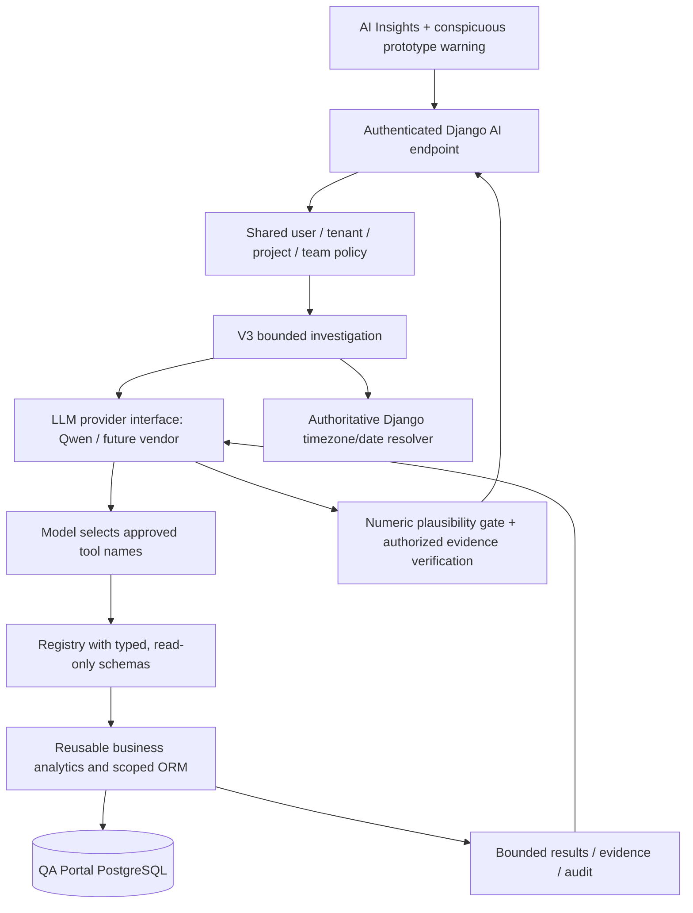

# CallLens AI Insights V3 — bounded agentic investigations

**Status:** implementation candidate; **not production validated**. V1 and V2 remain available. No GPU image or inference Compose changes. This is a new Django orchestration engine plus a persistent frontend safety banner.

## Intended change

Instead of mapping each message to a single model-chosen `intent` and a fixed database recipe, V3 allows Qwen (or an interchangeable LLM provider) to **select approved QA tools, examine real results, request further approved tools, and formulate a contextual answer**. Django still computes all metrics and enforces every user's data scope.



## V3 person-lookup and throttle hotfix (October 9, 2026)

- Corrected `lookup_visible_people` to use `team_leader__email` (and the existing `first_name`/`last_name` fields) instead of `team_leader__username`. The project's custom user model has `username = None`; the old lookup raised Django `FieldError` when the model invoked the tool.
- Added database-backed person-lookup regression tests (team leader full/partial/email, agent, project isolation) and a controlled-error test so future ORM query failures return a service-unavailable response rather than an unhandled 500.
- The AI chat throttle remains per authenticated user. Its default is now **60/hour**, configurable as `AI_CHAT_THROTTLE_RATE` in QA Portal `.env` (for example, `30/hour` for tighter production limits). This does not reset existing Redis throttle windows and should not be set to unlimited.
- HTTP 429 displays the upstream expected wait if provided by the API.
- No new database migrations, GPU updates, or changes to permissions. **V3 must remain disabled in production until the Django tests and staging end-to-end checks pass.**

## Backend changes

- `backend/apps/ai_assistant/investigation.py`: V3 multi-step engine. One typed tool-selection call, 1–5 initially selected tools, extra tool discovery if needed, per-tool JSON-schema argument checking, audits, duplicate-query blocking, limited result size, bounded iterations and generated-summary validation. The model cannot run unregistered tools, make network calls, send emails, write reports, or execute SQL.
- `backend/apps/ai_assistant/timeframes.py`: server-owned calendar dates, resolved with Django's currently activated branch timezone. Handles yesterday (including common misspelling `yesteray`), today, prior day, this/last week, this/last month, last/past N days (including simple number words), and explicitly supplied ISO dates. For unspecified periods, defaults to 30 days; a follow-up may reuse its prior *validated* window.
- `backend/apps/ai_assistant/person_tools.py`: resolves visible submitted evaluation participants as either **team leader** or **dialer agent**. Never automatically assumes that a named team leader is a dialer agent. Matches originate from reports authorized to the current user.
- `backend/apps/analytics/services/reviews.py`: the canonical pending-review calculation now accepts an optional `team_leader_id` narrowed **after** the authorized report queryset is built. Current backlog still includes carryover; `submitted_in_period` remains distinct.
- `backend/apps/ai_assistant/tools.py`: registers the authorized person-lookup tool and the optional team-leader filter. Business service stays usable outside AI.
- `backend/apps/ai_assistant/views.py` and `backend/config/settings.py`: `AI_ENGINE_VERSION` now supports `v3` alongside existing `v1` and `v2`; endpoints, credentials, conversation storage, session authentication, rate limiting, CSRF and metadata remain compatible. No new migration required beyond previously applied `0003_semantic_state`.
- `backend/apps/ai_assistant/tests.py`: synthetic QA fixture tests for named team leaders, unauthorized project isolation, tool selection and date enforcement, unsupported counts, and colloquial time phrases.

## Frontend change

A permanently visible Ant Design warning, directly under the AI Insights title, states that the feature is **an experimental prototype undergoing rigorous testing**. Users are explicitly instructed not to rely on its judgments for coaching, compliance, performance or disciplinary decisions without checking the actual QA reports. This banner appears even when the AI provider is unavailable, and is not dismissible.

## Major invariants and operational caveats

1. **Django is authoritative** for access, current date, scoring, metrics, evidence UUIDs and report history. The model only controls approved *investigation steps* and a tentative narrative; answers are labelled as a prototype.
2. After a model calls `lookup_visible_people`, an ID may be used to filter pending reviews only if that team leader was returned by a permitted lookup (or came from a previous conversation and is **reauthorized again**). A guessed ID cannot expand scope.
3. `find_pending_reviews` interprets *current backlog* as all unresolved submitted reviews, including older reports. Date windows describe the submission cohort. For explicit questions requesting only a submission period, the model can select `submitted_in_period`.
4. The relative-date resolver overwrites any model-supplied `date_from`/`date_to` on every time-filtered tool. This directly prevents "yesterday" accidentally being interpreted as a week in 2023.
5. Business-tool result details are truncated only with warnings, while aggregate values are never silently truncated. Failing aggregates abort the affected investigation. References are checked again against current authorized reviews before being returned to the frontend.
6. A lightweight numeric-support check rejects generated numbers absent from verified tool results. It is a **plausibility gate, not a mathematical or semantic proof**. Causal conclusions still need scrutiny; the banner is intentional.
7. Limits: 7 model rounds, 9 executed tools, 8 loaded business schemas, 14K total result characters, 105-second best-effort overall budget, and existing provider timeout per call. Repeated, invalid and oversized queries fail closed. These are initial development limits, not measured production SLAs.
8. Chat scope fingerprints still restrict owner and assignment changes. Tool outputs and sensitive QA notes are not persisted in the conversation, and audit rows keep metadata only.
9. No new RAG store, scorecard history warehouse, arbitrary SQL, call recordings, training/fine-tuning, administrator email routines, or side-effecting AI skills are included.
10. **Do not send actual QA data over your current public HTTP :18080 FastAPI connection.** Configure private encrypted networking or HTTPS before live AI access. This restriction remains even with an API key and source-IP allowlist.

## Environment and rollout

Only the CallLens Django host changes; leave `severarena` inference untouched.

```ini
# QA Portal .env; default remains v1 on first deploy
AI_ENABLED=false
AI_ENGINE_VERSION=v1
# Keep the existing AI_LLM_PROVIDER, AI_LLM_BASE_URL, AI_LLM_MODEL,
# AI_LLM_API_KEY(_FILE), AI_LLM_TIMEOUT_SECONDS and security settings.
```

Before applying to production, back up the database and confirm a controlled staging installation has the same 3 prior AI migrations applied. **Do not run concurrent migrations** with the normal backend entrypoint.

```bash
cd /opt/calllens/QA_Portal
docker compose config --quiet
docker compose build backend frontend
docker compose run --rm -e DB_DIRECT=true backend python manage.py check
docker compose run --rm -e DB_DIRECT=true backend python manage.py makemigrations --check --dry-run
docker compose run --rm -e DB_DIRECT=true -e PRODUCTION=false -e SECURE_SSL_REDIRECT=false backend python manage.py test apps.ai_assistant -v 2
# If tests pass: keep the live engine on v1 until further acceptance tests.
docker compose up -d --no-deps --force-recreate backend frontend
docker compose exec -T backend python manage.py showmigrations ai_assistant
```

In **staging with encrypted GPU connectivity**, enable V3 with `AI_ENABLED=true` and `AI_ENGINE_VERSION=v3` in `.env`, then recreate **only** `backend`. Verify values with `python manage.py shell`, and exercise authenticated UI queries as role-specific users. For rollback, set `AI_ENGINE_VERSION=v2` or `v1` and recreate backend; there is no V3 schema migration to reverse. To disable all AI, set `AI_ENABLED=false`.

### Must-pass staging acceptance matrix

| Query / situation | Required behavior |
|---|---|
| "How many reports has Ahsan Tanveer not reviewed?" | Look up Ahsan as a visible *team leader* (not a dialer agent), then filter only permitted pending QA reviews for that leader. Ask to clarify if name ambiguous. |
| "How many reports haven't been reviewed in the past four days?" | Date window equals the last four calendar days in branch timezone; distinguish current backlog and newly submitted cohort. |
| "How many critical violations were recorded yesterday?" | Use yesterday's single authoritative date for every tool, never a prior conversation's week or an invented year. |
| "Which agents repeatedly failed the same criterion?" | Choose recurrence tools, optionally investigate further with other allowed analytics tools, accurately distinguish scored deficits and explicit critical errors. |
| "Why did our team's QA fall?" | Compare periods and analyze observable QA criteria; do not assert unmeasured causes. |
| TL asks about another team/PM asks about unassigned project | No data outside existing permissions, even if LLM sends a forged UUID or another person's name. |
| Zero matching reviews | Explain there are no *matching accessible submitted* records, not that all managers completed every obligation. |
| Model invents a count, wrong tool call, repeated tool calls, oversized data | Reject or safely fall back, with a transparent warning. |
| Conversation scope changes | Access to stale references is denied/revalidated. |
| AI disabled/provider down | Prominent prototype banner remains visible; service reports unavailable, existing QA operations continue normally. |

### Runtime verification still required

The archive can be statically compiled and its TSX syntax validated offline. **Django/PostgreSQL integration tests and actual Qwen tool-choice/agent-roundtrip tests were not run in the artifact environment due to unavailable installed dependencies and GPU access.** Run these on a staging CallLens backend and test with a synthetic data fixture before switching any users to V3. Monitor GPU context length and latency carefully: V3 deliberately performs more model rounds than V2.
