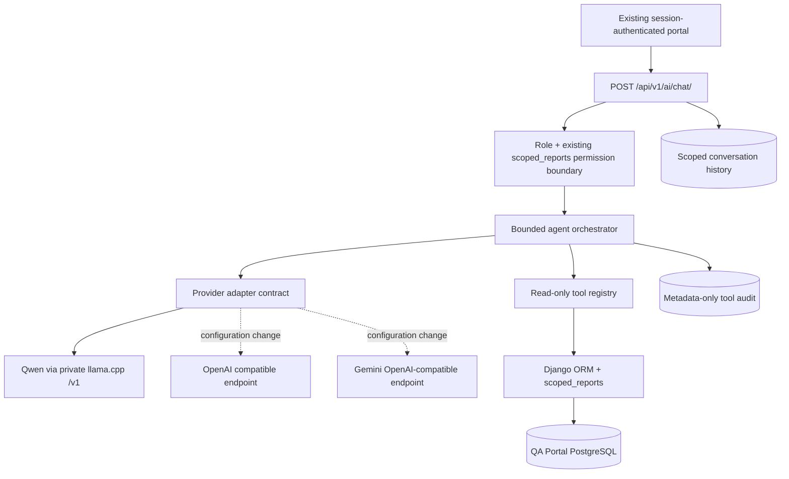

# QA Portal — provider-neutral Agentic AI backend

**Scope:** Implemented against the uploaded October 8, 2026 QA Portal source. The existing Django/frontend/call ingestion/notification workflows are untouched; this increment is an **opt-in read-only AI analytics backend**. Do not infer from these source changes that your production Django host can yet reach the GPU server.

## 1. Architecture



No Django business tool imports Qwen or `llama.cpp`. Only `provider.py` knows the inference transport. `get_provider().complete(messages, tools)` is the port that another native vendor adapter can implement without changing QA analytics.

## 2. Existing schema integration and boundaries

- Uses existing `accounts.User.Role`: **team leader**, **project manager**, **supervisor**, **administrator superuser**. QA analysts do not receive this management-chat endpoint by default.
- Reuses `apps.calls.views.scoped_reports()` on **every** tool query. This preserves per-QA ownership, team leader `Review.team_leader`, project-manager `QAProjectAssignment`, supervisor branch/company, and system administrator scopes. A supplied UUID/project/dialer username can **narrow but never widen** the authorized queryset.
- `CallEvent.agent_user` is a dialer-specific string, not an `accounts.User` FK. Repetition is grouped by `(dialer_id, agent_user)`; an agent display name is **not** treated as unique.
- Completed QA reports are those in `Review.Status.COMPLETED` or `DISPUTED`; TL review backlog uses `Review.LeaderStatus.PENDING` on submitted reviews. Draft reviews are deliberately excluded from management analytics.
- QA scores in `Review.scores` are per-criterion numeric scores. A score below maximum is recorded as a **below-maximum criterion**, not automatically a categorical critical error. Explicit `Review.critical_errors` are counted separately.
- Review-level evidence uses authorized `Review.id` UUIDs. No phone number, caller identity, recording URL, raw Vicidial payload, free-form QA notes, or audio leaves the tool layer.
- A conversation belongs to one Django user and a fingerprint of role, company, branch, assigned campaigns, and led teams. Scope changes invalidate old conversation access. **This is not a substitute for a legal retention policy**; run the pruning command on a schedule.

## 3. Tools (read-only)

| Area | Registered tools |
|---|---|
| Definitions/discovery | `get_scorecard_policy`, `list_available_branches`, `list_available_teams`, `list_available_projects`, `find_agents` |
| KPIs | `get_qa_overview`, `get_agent_performance`, `get_team_performance`, `get_project_performance` |
| Ranking/trends | `rank_agents`, `rank_teams`, `get_score_trend`, `compare_periods` |
| QA reviews | `find_pending_reviews`, `get_team_leader_review_summary`, `find_overdue_reviews`, `get_review_details`, `list_recent_reviews`, `get_review_workflow_events` |
| Compliance/repeats | `get_critical_error_summary`, `find_repeated_mistakes`, `find_repeat_critical_errors`, `get_criterion_failures`, `get_coaching_backlog` |

Tool schemas validate parameter types, enums, length, and list limits. Date ranges default to the last 30 calendar days, max 366 inclusive. Queries that need to inspect JSON failures cap scans at 3,000 records and **fail rather than silently truncate**. Tool results and aggregate outputs have explicit size limits. Tool routing supplies at most 9 relevant schemas per request to reduce Qwen's 8K context pressure. The agent is bounded to 6 tool calls and 5 model rounds.

**Limitations:** `get_coaching_backlog` reads `Review.leader_status` and `coaching_due_at`. It does not represent a separate coaching-session/attendance database, so do not ask it to prove coaching occurred. Repeated-criterion detection uses the current scorecard to interpret older reviews; mismatched historical scorecard versions require a dedicated historical-normalization improvement before relying on cross-version trend conclusions.

## 4. API contract

All endpoints use the existing Django **session cookie + CSRF** model, not a client-side copy of the GPU API key.

| Method | Path | Purpose |
|---|---|---|
| GET | `/api/v1/ai/metadata/` | Feature status, tool names and capabilities |
| POST | `/api/v1/ai/chat/` | Chat and controlled tool calls |
| GET | `/api/v1/ai/conversations/` | Up to 30 own current-scope conversations |
| GET | `/api/v1/ai/conversations/<uuid>/` | Own conversation history |
| DELETE | `/api/v1/ai/conversations/<uuid>/` | Delete own conversation |

Example request (authenticated portal browser, CSRF token present):

```json
{"message":"Which agents repeated Wasted Lead this month?"}
```

Follow-up:

```json
{"conversation_id":"<returned UUID>","message":"Which of those reports are still pending leader review?"}
```

Success fields: `conversation_id`, `answer`, `evidence` (verified review UUIDs when available), `tools_used`. Errors use DRF 400/403/404/409/429 and 503 for disabled/unavailable inference. The AI endpoint is **disabled by default**.

## 5. Backend configuration

In the Django host's `.env`, not the GPU server's `.env`:

```ini
AI_ENABLED=false
AI_LLM_PROVIDER=openai_compatible
AI_LLM_BASE_URL=https://<private-gpu-gateway>/v1
AI_LLM_MODEL=qa-qwen3-30b-a3b
AI_LLM_API_KEY=
AI_LLM_API_KEY_FILE=
AI_LLM_ALLOW_HTTP=false
AI_EXTERNAL_DATA_EGRESS_ALLOWED=false
AI_LLM_TIMEOUT_SECONDS=45
AI_LLM_MAX_OUTPUT_TOKENS=900
```

Fill the key using a deployment secret, or point `AI_LLM_API_KEY_FILE` to a secret file mounted **inside the Django backend container**, not the GPU container. Never commit credentials. The existing GPU instance publishes only `127.0.0.1:8080` **on the GPU host**; the Django container **cannot** reach that via its own `127.0.0.1`. Use authenticated HTTPS over a private VPN/reverse proxy or other specifically secured cross-host transport. Do not publish llama.cpp port 8080 publicly. If HTTP is unavoidable, `AI_LLM_ALLOW_HTTP=true` should be reserved for verified isolated internal networks, not public routes. Upstream TLS verification is enabled by default in `httpx`.

### Switching providers

The same backend tools and endpoints work with an OpenAI-compatible vendor API when configured with the appropriate base URL, model name, and API key. Use `AI_LLM_PROVIDER=openai` or `gemini_openai_compatible` to record the integration type. These **external** modes are refused unless `AI_EXTERNAL_DATA_EGRESS_ALLOWED=true` is explicitly authorized. They may incur data residency, privacy and retention requirements; review those separately before enabling. Provider-specific native SDK behaviors are **not yet implemented**: this initial adapter covers compatible chat completions with tools, which must be integration-tested against each vendor model.

## 6. Deployment procedure

1. Back up PostgreSQL and snapshot the existing application revision. Merge the backend code into a staging branch.
2. Deploy with `AI_ENABLED=false`; run `docker compose build backend` (no GPU image build needed).
3. Validate migrations **before** enabling any AI traffic:

   ```bash
   docker compose run --rm backend python manage.py check
   docker compose run --rm backend python manage.py makemigrations --check --dry-run
   docker compose run --rm backend python manage.py migrate --plan
   docker compose run --rm backend python manage.py test apps.ai_assistant -v 2
   ```

4. Apply schema migration (using the project's existing migration/deployment workflow):

   ```bash
   docker compose run --rm backend python manage.py migrate
   ```

5. Configure a securely reachable GPU URL and key. From **inside Django container**, use a non-secret health probe `curl`/Python; do not echo API keys in shell logs. Validate the model `/v1/models` from the backend container using a one-time secure credential test.
6. Flip `AI_ENABLED=true`, recreate the Django backend, and authenticate through an existing team-leader or PM portal account. Call `/api/v1/ai/metadata/`, then `/api/v1/ai/chat/`. Validate returned Review UUIDs against the existing report screen.
7. Run staging isolation checks: two TLs from different teams, PM with one campaign assigned, supervisor from another branch, inactive user, QA analyst, and global superuser.
8. Observe GPU load under concurrent chat sessions, PostgreSQL query metrics, and audit outcomes. Keep the existing GPU service unchanged.

### Rollback

Set `AI_ENABLED=false` and recreate the Django backend. This stops the feature without changing call/review behavior. You do not need to downgrade database migrations to disable the feature. Do not reverse migrations containing conversation history without an explicit data-retention decision.

## 7. Security and operational controls

- DRF authentication, CSRF, role permission and per-user `15/hour` chat throttling.
- No dynamic SQL, model-controlled HTTP URL, shell, recording access, or mutation tool.
- Tool argument types validated; missing/unauthorized records are indistinguishable in single-review lookups.
- Selected tool output supplied as *untrusted data*; the system prompt forbids executing its embedded instructions.
- Tool calls store only name/outcome/duration; full tool JSON response is not persisted in the audit. Conversation texts are stored in DB; restrict backups/DB console accordingly.
- Historical conversations are invalidated when project/team assignments or role/branch change; the authorized queryset is re-evaluated **for every** tool call.
- To expire records, schedule (external cron or operations scheduler):

  ```bash
  docker compose exec -T backend python manage.py prune_ai_history --days 30 --audit-days 90
  ```

- Long-running synchronous inference must be considered in reverse-proxy/Uvicorn timeout and worker sizing. Use GPU-side 2-slot capacity as a starting constraint, not an SLA.

## 8. Deliberately excluded from this increment

- **No frontend AI chat UI** yet (the endpoints can be exercised with authenticated browser/DRF tooling).
- **No administrator routine scheduler, Gmail sending, or side-effecting AI skills** yet. The requested Mars → Arena 8 AM email reminder workflow requires a separate administrator-only scheduled-execution service, authoritative per-project PM email responsibility mapping, opt-in/approval, idempotency, delivery logs, timezone/DST rules, and a scheduler. Existing notification email removal remains unchanged.
- No policy-document RAG store; `get_scorecard_policy` currently reads code-defined scoring rules.
- No automatic fine-tuning, transcription or raw recording access.
- No promise of production readiness until Django tests, real GPU connectivity, access-control checks and staged end-to-end data tests pass.
