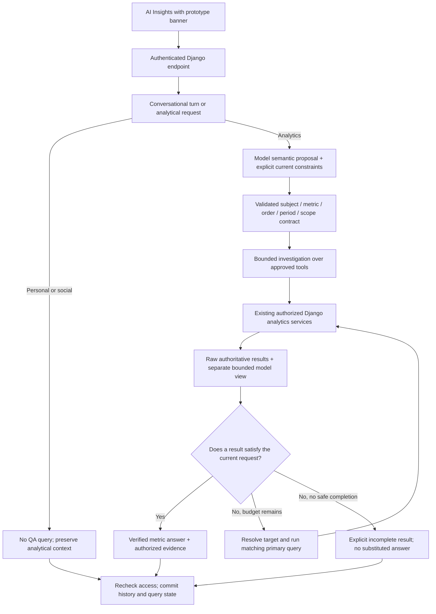

# CallLens AI V3: request contracts and conversation lifecycle

## Release status

This update is based on **CallLens_QA_Portal_V3_Identity_Fix_Complete.zip**, the last complete repository delivered in this conversation. It does not include changes made independently on your server after that version.

The engine flag remains **`AI_ENGINE_VERSION=v3`**. This is a coordinated correction to the V3 request lifecycle, not another engine version, GPU deployment, or database migration. V1/V2 code paths, existing migrations, provider configuration, source-IP restrictions and the prototype banner are retained.

**Not production certified.** The local checks below exercise contracts and the actual controller, but this workspace could not install Django dependencies because package-source DNS was unavailable. PostgreSQL-backed tests, the full React production build, browser testing and live Qwen acceptance therefore still need to run in staging. No claim is made that an LLM will understand every possible question.

## Why these changes are necessary

Previously, independently implemented keyword recovery, stored agent-ranking context, and a final-response fallback could disagree. The model could explore one team leader, reach its execution limit, and return that last individual result as the answer to a question about all leaders. A team question could take the agent-ranking path; "best" could reuse the previous "worst" direction. "All time" did not have a representation distinct from the default date range.

A request now has a validated **query contract** describing its subject, operation, metric, ordering, named target versus collection, scope filters, and timeframe. The model still proposes semantics and can use additional approved tools. Neither model output nor conversation memory can change the user's permissions. A final result must match the current contract before it can answer a numerical question.



## Changes to the user experience

### Teams and agents remain different subjects

- "Which team performed worst in the past 10 days?" uses `rank_teams`, not `rank_agents`.
- Team performance defaults to **average QA score**: lowest for worst, highest for best. The answer states the metric and minimum sample requirement.
- A subsequent "and which team performed best?" changes the ordering while retaining a compatible reporting period.
- "Most critical violations" uses the number of evaluations containing an explicit critical error. It is not an individual-event count, error severity, or an overall judgment of a worker.
- Equal values remain tied. Team and agent identities are not interchangeable.
- A ranking without enough scored evaluations returns a sample-size limitation, not an unrelated critical-error ranking.

This release retains the existing three-scored-evaluations minimum for average-score rankings. Comparisons still reflect evaluated samples, not necessarily every call handled by every team.

### Collective backlogs cannot become individual answers

The primary result for "Which team leaders have pending reports?" must cover the requested authorized collection. An unrequested `team_leader_id`, agent filter, or age cutoff cannot silently narrow that primary query. A named person request uses the authorized directory and existing ambiguity/approximate-match confirmation safeguards.

Once a direct metric request has a verified primary result, the next model turn is offered no further tools. Unrequested follow-on lookups are not executed. This is a completion condition, not a larger retry budget.

Finalization is shared by normal completion, model refusal, model failure after retrieval, round limits, call limits and context limits. A matching primary aggregate is used if available; otherwise a limited amount of the **existing** budget is reserved for it. If no matching primary can be obtained, the response is explicitly incomplete. The last supplementary lookup is not promoted to a group-wide answer.

The full authorized aggregate and leader rows are kept separately from the smaller result sent to the model. Detail truncation cannot mutate those raw facts. Up to 60 leader groups can be returned by the service; larger breakdowns are labeled as truncated while aggregate totals remain complete.

### All time is explicit

`all_time=true` means **no submission-date cutoff**, with null date boundaries. It is not a 30-day default, a made-up date in the distant past, or a historical state snapshot.

- Current pending backlog includes older outstanding reviews.
- A bounded submission cohort is reported separately from carryover before the period, later submissions, and missing timestamps.
- Age-filtered totals and cohort counts use the same queryset.
- All-time summary, ranking and supported discovery services keep the same authorization rules.
- Existing scan/detail limits still apply. All time does not authorize an unlimited context dump.
- A period comparison needs bounded intervals; a daily trend cannot exceed 366 populated date buckets. These fail explicitly rather than silently inventing a shorter period.

### Casual and personal conversation

Common greetings, availability questions, wellbeing questions, thanks, identity/capability questions, and basic questions about the assistant have a separate non-analytical path. They do not query QA records or delete the previous analytical state.

Unfamiliar purely personal phrasing can be classified semantically into an approved conversational topic. The classifier does not generate employee statistics or grant tool access; the reply remains limited to information about the assistant. Obvious mixed messages such as "Hello, which team performed best?" still use analytics.

"Are you available?" acknowledges that the assistant is responding. It is **not** a claim that every downstream GPU/database service is healthy. Social turns remain subject to the existing user eligibility, feature flag, conversation ownership, and rate limit.

### Frontend feedback

AI Insights now shows the analytical subject, selected metric, ordering and explicit all-time label. Incomplete responses are labeled. Personal replies do not carry irrelevant analytics-date badges. The loading text does not claim to be querying QA for a greeting.

Existing Markdown rendering, evidence links, themes and the persistent prototype warning remain in place.

## Implementation boundaries

| Module | Responsibility |
| --- | --- |
| `ai_assistant/query_contract.py` | Provider-independent meaning of the current request; context reuse, subject/order precedence and primary-query matching |
| `ai_assistant/social.py` | Bounded conversational channel, no QA data access |
| `ai_assistant/answer_contracts.py` | Primary result shape checks and factual rendering; cannot substitute agent rows for teams |
| `ai_assistant/investigation.py` | Model tool selection, scoped discovery, execution ledger, budgets and one shared finalizer |
| `ai_assistant/timeframes.py` | Authoritative branch calendar and explicit all-time state |
| `ai_assistant/registry.py` | Validate raw arguments before canonicalization; reject unknown properties and contradictory dates |
| `analytics/services/*` | Existing authorized business services, now with consistent all-time support and team-ranking fields |
| `ai_assistant/views.py` | Keep conversation lock through persistence; refresh and recheck authorization after inference |
| `tests_contracts.py`, `tests_contract_integration.py` | Pure semantics and real-model/real-ORM regression suites |
| `tests_live_acceptance.py` | Explicitly enabled live-provider conversations with synthetic QA fixtures |

Django still calculates metrics and permissions. The inference server remains interchangeable. No business service imports Qwen or calls the GPU directly.

For typed primary metrics, the final numeric result is rendered from the verified primary query rather than accepting arbitrary model prose. Open-ended investigations outside those metric contracts still use model narrative and the existing prototype plausibility checks; that is not a complete proof of semantic correctness or causality. Complex/ambiguous questions may still need clarification. Do not use this feature as an autonomous personnel decision system.

### Execution and safety

- Every domain query still applies the existing management/report visibility policy.
- Unexpected parameters are rejected **before** any parameter canonicalization.
- Directory suggestions do not silently authorize another identity.
- At most 9 tool attempts, 7 investigation rounds, 10 loaded business schemas and the existing best-effort 105-second turn budget are used. Failed, duplicate and discovery attempts count toward the budget; repeated identical reads can reuse a result only within the same turn.
- The request-size guard is a conservative character limit, **not an exact Qwen token budget**. Measure actual context and latency in live acceptance.
- The overall deadline remains best effort: an in-flight synchronous provider/database call is bounded by its own timeout, not forcibly cancelled at the overall deadline.
- Evidence comes from the displayed primary result and is rechecked against current permissions.
- Stored context contains a query specification, not saved tool-result tables. Follow-ups requery the current authorized data.
- The endpoint refreshes the user's permissions before returning/saving the result and keeps the conversation lock through the history/state commit.
- Reviewer free text remains opt-in via `AI_SEND_REVIEW_FEEDBACK`; raw audio, credentials, customer phone numbers and unrestricted SQL remain outside the tools.

## Validation performed in this workspace

| Check | Result |
| --- | --- |
| Pure request/calendar/social/answer contract tests | **28 passed** |
| Actual V3 controller with actual tool schemas and in-memory domain/provider ports, including existing pure regressions | **35 passed** |
| Python source compilation | Passed |
| Changed TypeScript/TSX syntax transpilation | Passed; not a full typecheck/build |
| Shell script syntax | Passed |
| Full Django/PostgreSQL suite | Not run here: Django dependencies unavailable and package download DNS failed |
| Live Qwen multi-turn suite | Not run here: no access to your endpoint/credentials |
| Full React production build / browser UI tests | Not run here |

The offline controller harness explicitly substitutes database, audit, authorization and provider ports. It verifies controller behavior, **not real access isolation or SQL correctness**. The separate ORM suite uses the actual project models and policy with only the language-model responses mocked. The six live-provider acceptance tests are skipped unless explicitly enabled; a normal green test run must not be described as a live-Qwen pass.

The existing `tests.py` was not edited to weaken expectations. This release adds **20 real-ORM/endpoint tests**, **28 pure contract tests**, and **6 opt-in live-provider acceptance tests** in separate modules.

## Staging deployment and acceptance

### 1. Merge the complete repository into your existing checkout

Preserve your `.env`, Git history, media, recordings, databases and deployment-specific files. The source archive contains no deployment credentials or GPU model weights. Review `AI_REQUEST_CONTRACT_CHANGES.json` for exact changed-file hashes against the prior complete identity-fix ZIP.

Do not enable a new engine or change the GPU server. Keep your selected production engine unchanged until staging acceptance succeeds.

### 2. Run the fail-fast validation script

From a **staging** QA Portal checkout with the same Compose services:

```bash
cd /opt/calllens/QA_Portal
bash scripts/validate_ai.sh
```

It builds backend/frontend, checks migrations and runs the full AI Django suite. It stops on any failure. It does **not** recreate the running application or enable AI.

The test run uses `config.ai_test_settings`: a separate `test_calllens_ai` PostgreSQL database, in-memory cache/channel layer/task broker, disabled DB telemetry and in-memory email. This avoids using live cache/throttle state or executing outbound background jobs. The database user must be permitted to create the separate test database. Do not point `AI_TEST_DB_NAME` at a live database, run two test jobs using the same test name concurrently, or pass `--keepdb` against an unrelated database.

### 3. Run live Qwen acceptance on synthetic data

The test module creates its own synthetic team/agent/review fixtures. It does not seed or inspect your production reports.

```bash
docker compose run --rm \
  -e DB_DIRECT=true \
  -e PRODUCTION=false \
  -e DJANGO_DEBUG=false \
  -e SECURE_SSL_REDIRECT=false \
  -e AI_ENGINE_VERSION=v3 \
  -e AI_LIVE_ACCEPTANCE=1 \
  -e AI_LIVE_REPEATS=3 \
  backend python manage.py test \
  apps.ai_assistant.tests_live_acceptance \
  --settings=config.ai_test_settings --noinput -v 2
```

The configured LLM URL/key are used. This run consumes GPU time and can take several minutes. `AI_LIVE_REPEATS` is clamped to 1-3 and repeats the team worst/best/social/next sequence; other acceptance scenarios each run once. Confirm the resulting report lists these tests as passed, not skipped.

The existing public HTTP connection is not encrypted even with IP filtering and an API key. Prefer HTTPS/private encrypted transport for this run, and require it before enabling real QA analytics. No production firewall needs to be disabled.

### 4. Deploy only after validation

There are **no new model migrations** in this release. The prior three AI migrations should already exist. Keep the usual database backup/snapshot and Git revision rollback procedure.

```bash
docker compose up -d --no-deps --force-recreate backend frontend

docker compose exec -T backend python manage.py check
docker compose exec -T backend python manage.py showmigrations ai_assistant

docker compose exec -T backend python manage.py shell -c "
from django.conf import settings
print('AI enabled:', settings.AI_ENABLED)
print('AI engine:', settings.AI_ENGINE_VERSION)
"

docker compose ps
docker compose logs --tail=100 backend
```

`AI_ENGINE_VERSION=v3` selects this corrected path. Do not change provider credentials, model names, database URLs or other environment values merely to deploy these code changes.

### 5. Browser acceptance

Start a fresh conversation, then exercise these sequences and compare with the authorized reports:

1. Ask for **teams** with worst performance in the past 10 days, then best. Verify team names, reversed ordering, identical metric/period, sample sizes and ties.
2. Ask about one named leader, then all leaders' pending reports this week. Verify the collective query does not retain that person's filter.
3. Ask for all-time backlog. Verify a no-date-cutoff label and inclusion of older pending reports.
4. Ask "how are you?", "are you available?", and a differently worded personal question. Verify no QA evidence/date badge, then "who's next?" after a ranking retains the intended analytical state.
5. Repeat as a team leader, project manager and supervisor in disjoint scopes. Verify unauthorized teams/reviews never appear, including after assignment removal during an active conversation.
6. Stop the provider or force an execution-limit scenario in staging. Verify an explicit incomplete response or a verified primary result, never a different subject or the last individual lookup.
7. Verify Markdown, prototype warning, history, evidence navigation and narrow-screen layout.

### Rollback

V1/V2 remain available by changing `AI_ENGINE_VERSION` and recreating only backend. `AI_ENABLED=false` disables the AI endpoint. Shared analytics changes also serve legacy engines, so an engine flag alone is **not a full source rollback**: keep the previous application revision/image to revert the entire change if necessary. Do not reverse existing migrations or delete volumes to disable this feature.
